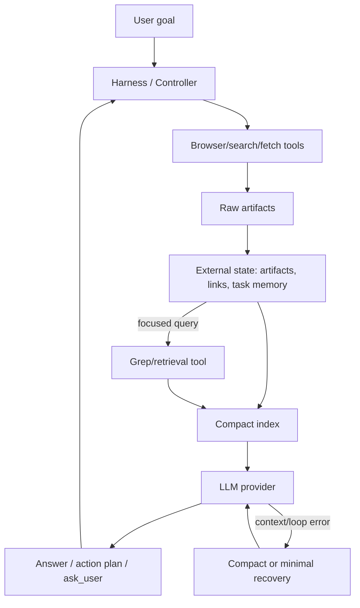

# Context Synthesis Architecture Report

Report tecnico riusabile per progetti che devono far lavorare LLM/agent su contenuti troppo grandi per entrare stabilmente nella context window.

Questo documento parte dall'architettura di Browser Companion, ma astrae i pattern in modo che possano essere applicati anche a estensioni browser, agent harness, RAG leggeri, workflow di ricerca o automazioni con provider locali.

## Executive Summary

Quando i contenuti crescono oltre la finestra del modello, la soluzione robusta non e' "mandare meno testo" in modo generico. Serve un sistema a livelli:

1. Tenere gli artefatti grandi fuori dal prompt, dentro l'harness.
2. Mandare al modello un indice compatto e riferimenti stabili.
3. Usare agenti/passaggi di sintesi per trasformare raw output in digest.
4. Scalare da full a compact a minimal quando il provider segnala limiti.
5. Consentire resume/checkpoint invece di perdere il lavoro.
6. Offrire retrieval mirato, tipo grep, quando l'indice non basta.

La regola centrale e':

> Il prompt deve contenere il minimo contesto sufficiente per decidere il prossimo passo, non tutta la storia del task.

## Glossario

- **Harness**: il runtime esterno al modello. Tiene stato, artefatti, link, risultati, memoria e policy. Decide cosa inviare al modello e cosa eseguire.
- **Artifact**: risultato grezzo di un tool: pagina osservata, search results, fetch HTTP, screenshot/OCR, tab aperto, DOM snapshot.
- **Index**: rappresentazione compatta degli artifact. Include titoli, host, counts, snippet brevi, IDs, stato, timestamps.
- **Digest**: sintesi strutturata di un artifact o batch di artifact, pensata per essere riusata in sintesi successive.
- **Condense**: passaggio di compressione che riduce testo lungo in uno schema piu' piccolo e stabile.
- **Link refs**: ID brevi tipo `L1`, `L2`, `L19` che sostituiscono URL lunghi nel prompt.
- **Compact mode**: contesto ridotto ma ancora ricco: meno elementi, meno testo visibile, artefatti deduplicati.
- **Minimal mode**: contesto di emergenza: solo goal, breve task memory, ultimi risultati compatti, pochi tab/link, osservazione minima.
- **Synthesis agent**: richiesta al provider dedicata a produrre risposta/digest, non nuove azioni browser.
- **Recovery agent**: richiesta stretta che corregge loop, hidden reasoning, malformed output o fallimenti di sintesi.
- **Grep/retrieval**: tool o API dell'harness che cerca in memoria esterna e restituisce excerpt piccoli, non tutto il corpus.

## Problema

I failure mode tipici sono:

- il provider rifiuta la richiesta per context limit;
- il modello locale spende budget in hidden reasoning e non produce output finale;
- la sintesi post-tool reinvia troppi artifact gia raccolti;
- il planner rilegge la stessa pagina o ripete la stessa search;
- i link lunghi consumano token e sporcano il reasoning;
- il transcript cresce e il modello perde il task corrente;
- l'utente deve ricominciare dopo un errore.

Browser Companion ha incontrato un caso concreto: la sintesi post-azione, anche in retry compatto, poteva superare una finestra da 32k token. La risposta e' stata introdurre retry minimal e checkpoint Resume.

## Architettura a Livelli



L'harness e' il proprietario della verita'. Il modello vede solo una vista, non l'intero stato.

## Pipeline Raccomandata

### 1. Raw Capture

Raccogliere dati in forma completa quanto serve al tool, non quanto serve al prompt.

Esempi:

- pagina osservata con testo visibile, link, button, form, repeated items, outline;
- `web_search` con query, titolo, URL, snippet;
- `http_request` con status, final URL, content type, body preview;
- tab aperti con titolo, URL, access status;
- screenshot/OCR quando necessario.

Il raw va salvato nello store dell'harness. Il prompt riceve una vista compressa.

### 2. Normalizzazione Strutturata

Prima di sintetizzare, normalizzare ogni artifact:

- tagliare campi troppo lunghi;
- preservare URL/canonical URL in store, ma inviare refs brevi;
- mantenere counts e metadata;
- deduplicare blocchi uguali o quasi uguali;
- estrarre titoli, sezioni, structured items e focused context.

Pattern:

```js
artifact -> normalizedArtifact -> compactArtifact -> providerPayload
```

Non fare parsing fragile a stringhe quando esistono dati strutturati.

### 3. Link Reference Registry

Gli URL lunghi sono costosi e spesso ripetuti. Il pattern e':

```json
{
  "ref": "L19",
  "host": "linkedin.com",
  "hint": "linkedin.com/jobs/view/...",
  "title": "Data Analyst - Example",
  "snippet": "Mestre, hybrid, ..."
}
```

Il modello usa `L19` nell'action plan. L'harness risolve `L19` nel full URL prima di eseguire.

Vantaggi:

- riduce token;
- evita errori di copia/incolla URL;
- permette policy/validation sul link reale;
- consente minimal mode con solo ultimi N refs;
- mantiene privacy/log sanitization piu' semplice.

Nel progetto corrente, `getLinkReferencesForProvider()` invia solo ref, host, hint, titolo e snippet; in minimal taglia ulteriormente titolo/snippet e limita il numero di ref.

### 4. Task Memory come Indice del Lavoro

Il transcript non deve essere l'unica memoria del task. Serve una task memory strutturata:

```json
{
  "rootGoal": "...",
  "currentGoal": "...",
  "constraints": ["..."],
  "explored": [{"query": "...", "status": "..."}],
  "findings": [{"label": "...", "source": "..."}],
  "deadEnds": [{"label": "...", "reason": "..."}],
  "nextSteps": [{"label": "..."}]
}
```

Questa memoria e':

- aggiornata deterministicamente dall'harness;
- mandata al provider come JSON separato;
- condensata in `brief` per compact/minimal;
- usata per evitare loop e ricerche duplicate.

In minimal mode la task memory deve diventare un breve indice operativo, non un diario completo.

### 5. Full, Compact, Minimal

La strategia a tre livelli evita sia spreco sia perdita prematura di informazione.

**Full / Standard**

Usare quando:

- pagina/artifact sono piccoli;
- modello ha context window ampia;
- e' il primo tentativo;
- l'informazione completa e' utile al ragionamento.

Contiene:

- goal;
- runtime context;
- conversation window recente;
- observation compatta ma ricca;
- recent actions;
- task memory;
- link references;
- attachment text se permesso.

**Compact**

Usare quando:

- il provider segnala context limit;
- c'e' timeout;
- la sintesi post-tool fallisce;
- il modello ripete azioni read-only.

Riduce:

- visible text;
- numero di link/button/form;
- body preview HTTP;
- search results per query;
- user memory content;
- attachments omessi;
- recent artifacts deduplicati.

**Minimal**

Usare quando compact fallisce o per resume manuale.

Contiene solo:

- goal corrente timestampato;
- continuation instruction stretta;
- task memory brief;
- ultimi pochi recent actions;
- pochi accessible tabs;
- link refs brevi;
- observation ridotta a titolo, counts, 700-900 caratteri o focused snippets;
- risultati sintetizzati in poche righe;
- niente attachment text;
- niente transcript lungo;
- niente full user memory content.

Minimal non deve essere "un compact un po' piu' corto"; deve essere una modalita' concettualmente diversa: decisione sul prossimo passo usando un indice.

## Synthesis Agents

Un synthesis agent non deve decidere nuove azioni browser. Deve trasformare evidence in risposta o digest.

### Post-Action Synthesis

Dopo search/fetch/observe:

1. gli artifact grezzi vanno in action notes o store;
2. la chat riceve una risposta sintetizzata;
3. il provider vede un payload di sintesi, non il transcript intero.

Failure handling:

```text
full synthesis
  -> if provider-like error: compact synthesis
  -> if still recoverable: minimal synthesis
  -> if still failing: recovery agent or Resume checkpoint
```

Regola: non mostrare raw search output come risposta finale se si puo' sintetizzare.

### Deep Search Digest Pipeline

Per ricerche grandi conviene usare piu' agenti/passaggi:

1. **Planning**: genera query e coverage strategy.
2. **Collection**: fetch pubblico ampio.
3. **Source digest**: ogni batch di pagine diventa digest strutturato.
4. **Batch synthesis**: molti digest diventano batch summaries.
5. **Final report synthesis**: solo digest selezionati e batch summaries entrano nel report.
6. **Fallback report**: se la sintesi finale fallisce, usare artifact persistiti.

Nel progetto corrente i limiti sono espliciti:

- search query iniziali: fino a 32;
- refinement rounds: fino a 4;
- fetch totali: fino a 80;
- source digest finali: fino a 24;
- batch summaries prima della meta-sintesi.

Questo e' un buon pattern generale: raccogliere ampio, sintetizzare stretto.

## Recovery Agents

I recovery agent sono prompt corti e prescrittivi, non una ripetizione del prompt originale.

Usarli per:

- hidden reasoning senza final content;
- malformed JSON/action plan;
- read-only loop;
- sintesi post-action fallita;
- context retry dopo provider error.

Esempio di istruzione:

```text
Loop recovery controller:
The previous attempt repeated a read-only context action after successful context gathering.
Do not return observe_page/get_visible_text/get_links for the same page/query.
Use recent action results, page observations, link references, search results, and task memory.
Return exactly one JSON object: agent_plan, natural_response, or ask_user.
```

Principio: il recovery prompt deve togliere contesto non necessario e aggiungere vincoli nuovi. Se reinvia la stessa richiesta con lo stesso contesto, spesso riproduce lo stesso errore.

## Resume Checkpoints

Quando anche recovery/minimal falliscono, non bisogna perdere lo stato. Serve un checkpoint.

Un `pendingResume` tipico contiene:

```json
{
  "id": "uuid",
  "reason": "context_limit",
  "goal": "original user goal",
  "detail": "what failed",
  "continuationReason": "strict resume instructions",
  "planContext": {"tabId": 123, "url": "..."},
  "resultSummaries": ["search_1 - success - ..."],
  "createdAt": 123456789
}
```

Il bottone Resume:

- cancella il checkpoint per evitare doppi click;
- forza `minimalProviderContext`;
- omette attachments;
- manda una continuation instruction;
- usa task memory/recent actions/link refs come indice;
- non reinvia il transcript completo.

Questo e' utile specialmente con modelli locali piccoli o thinking models che consumano budget in ragionamento.

## Harness e Stato Esterno

L'harness deve tenere fuori dal prompt:

- full URLs;
- full observations;
- body HTML/testi lunghi;
- screenshot data URL;
- attachment text;
- debug logs;
- full fetched sources;
- transcript storico oltre le ultime richieste utili.

Nel prompt entra:

- indice;
- excerpt;
- digest;
- refs;
- counts;
- goal corrente;
- ultimi messaggi se davvero necessari.

Questa separazione permette di cambiare provider o context mode senza perdere lavoro.

## Grep / Retrieval su Memoria Esterna

Nel progetto corrente il concetto e' documentato come prossimo livello architetturale, non come tool generale gia completo. Il pattern consigliato e':

1. salvare artifact grandi in uno store esterno;
2. creare un indice ottimizzato nel prompt;
3. offrire un tool `grep_memory` o `retrieve_artifact_excerpt`;
4. il modello chiede solo query mirate;
5. l'harness restituisce piccoli excerpt con IDs e provenance.

Schema API consigliato:

```json
{
  "query": "Deloitte Mestre data analyst",
  "scope": "recent_actions|observations|fetched_sources|attachments|all",
  "limit": 5,
  "max_chars_per_hit": 600
}
```

Risposta:

```json
{
  "hits": [
    {
      "artifact_id": "obs_42",
      "kind": "page_observation",
      "title": "LinkedIn jobs",
      "url_ref": "L19",
      "excerpt": "...",
      "score": 0.82
    }
  ]
}
```

Regole:

- mai restituire l'intero artifact;
- sempre includere provenance;
- preferire ricerca lessicale deterministica prima di semantica costosa;
- cache dei risultati recenti;
- limite hard su char/token restituiti.

Per progetti piccoli basta SQLite FTS5. Per progetti medi: SQLite FTS + embeddings opzionali. Per web-scale: vector DB + lexical fallback.

## Condense Strategy

Un buon condense non e' una parafrasi libera. Deve produrre dati stabili:

```json
{
  "summary": "2-3 frasi",
  "key_facts": ["..."],
  "entities": ["..."],
  "dates": ["..."],
  "locations": ["..."],
  "important_links": [{"label": "Apply", "url_ref": "L19"}],
  "risks_or_gaps": ["..."],
  "source_confidence": 0.75
}
```

Condense deve preservare:

- decision points;
- vincoli utente;
- fonti;
- URL/ref;
- incertezze;
- next actions.

Condense puo' buttare:

- boilerplate;
- duplicati;
- navigazione;
- HTML noise;
- liste lunghissime non filtrate;
- ragionamento interno del modello.

## Quando Usare Quale Tecnica

| Situazione | Tecnica |
| --- | --- |
| URL lunghi o ripetuti | Link refs |
| Pagina grande ma task mirato | Focused context + compact observation |
| Risultati search/fetch numerosi | Post-action synthesis |
| Ricerca lunga multi-sorgente | Digest -> batch synthesis -> final synthesis |
| Context limit provider | compact retry, poi minimal retry |
| Hidden reasoning senza output | finalization retry o recovery agent |
| Loop su observe/search | recovery prompt con azioni vietate |
| Utente non vuole perdere lavoro | Resume checkpoint |
| Informazione esterna non nel prompt | grep/retrieval mirato |
| Transcript lungo | task memory + ultime richieste complete |

## Pseudocode Generico

```js
async function askProvider(goal, context) {
  const standard = buildPayload(goal, context, "standard");
  let result = await provider(standard);
  if (ok(result)) return result;

  if (isContextOrProviderFailure(result)) {
    const compact = buildPayload(goal, context, "compact");
    result = await provider(compact);
    if (ok(result)) return result;
  }

  if (isRecoverable(result)) {
    const minimal = buildPayload(goal, context, "minimal");
    result = await provider(minimal);
    if (ok(result)) return result;
  }

  if (isLoopOrHiddenReasoning(result)) {
    const recovery = buildRecoveryPayload(goal, context, result);
    result = await provider(recovery);
    if (ok(result)) return result;
  }

  saveResumeCheckpoint(goal, context, result);
  return showResumeToUser();
}
```

## Implementation Checklist

- Store raw artifacts outside the model prompt.
- Assign stable IDs to artifacts and links.
- Replace full URLs with link refs in provider payloads.
- Preserve a task memory ledger separate from chat history.
- Build context modes: standard, compact, minimal.
- Make compaction deterministic where possible.
- Use synthesis agents for post-tool responses.
- Use digest/batch/meta synthesis for large research.
- Detect provider-like errors explicitly.
- Add recovery prompts that change instructions, not only payload size.
- Persist resume checkpoints.
- Add grep/retrieval over external memory before the prompt starts carrying too much index.
- Log sanitized payload metadata and retry modes.
- Keep hidden reasoning out of user output and execution decisions.

## Anti-Patterns

- Sending the full transcript every turn.
- Sending all links as full URLs.
- Asking the model to "summarize everything" without schema.
- Treating hidden reasoning as executable intent.
- Retrying the same prompt after a loop.
- Dropping artifacts after a failed synthesis.
- Letting user-facing chat become the only source of truth.
- Using semantic search without lexical fallback/provenance.
- Returning huge retrieval hits that recreate the context problem.

## Recommended Minimal Architecture for Similar Projects

For a new project, start with:

1. `ArtifactStore`: raw tool outputs keyed by ID.
2. `LinkRegistry`: maps `L#` to full URL and metadata.
3. `TaskMemory`: compact ledger of goals, findings, explored paths.
4. `ContextBuilder`: produces standard/compact/minimal payloads.
5. `SynthesisAgent`: turns artifacts into answer/digest.
6. `RecoveryController`: handles context, timeout, loop, malformed output.
7. `ResumeCheckpoint`: persists interrupted task state.
8. `GrepTool`: focused retrieval over raw artifact store.

This gives most of the benefit before adding a full RAG stack.

## Practical Rule of Thumb

Budget the prompt like this:

- 10-15% system/tool/schema instructions;
- 10% user goal and current runtime context;
- 20% task memory and recent action index;
- 20-30% focused evidence excerpts;
- 10% link/reference index;
- 10% safety/recovery instructions;
- keep 25-40% of model window free for output/reasoning, especially on thinking models.

If the provider is local/small, be more aggressive: start compact, quickly move to minimal, and use retrieval for missing detail.

## Current Browser Companion Mapping

- Link refs: implemented in sidepanel link registry and resolved before action execution.
- Task memory: implemented as session-scoped ledger.
- Standard/compact/minimal provider modes: implemented for agent requests and post-action synthesis retry.
- Post-action synthesis: implemented through native-host `synthesis_request`.
- Recovery prompts: implemented for hidden reasoning, read-only loops, malformed planner drafts, and post-action synthesis errors.
- Resume checkpoint: implemented for recoverable provider/context/loop failures.
- Deep Search digest/batch/final synthesis: implemented for large research runs.
- General grep over external memory: proposed next step, not yet a complete tool.

## Portability Notes

In other stacks, replace the Chrome extension pieces with equivalent components:

- Browser extension -> web app/backend worker.
- Native host -> server-side orchestrator.
- Chrome storage -> SQLite/Postgres/local files.
- Action policy -> tool permission layer.
- Link refs -> URL/entity resolver table.
- Deep Search tab -> async job/report page.

The invariant remains the same: the model should reason over compact, cited, recoverable context views while the harness owns full state and execution.
